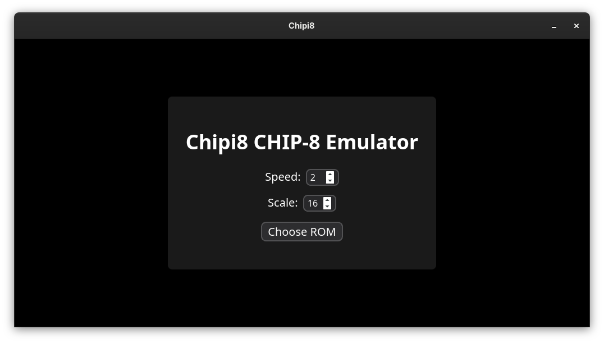
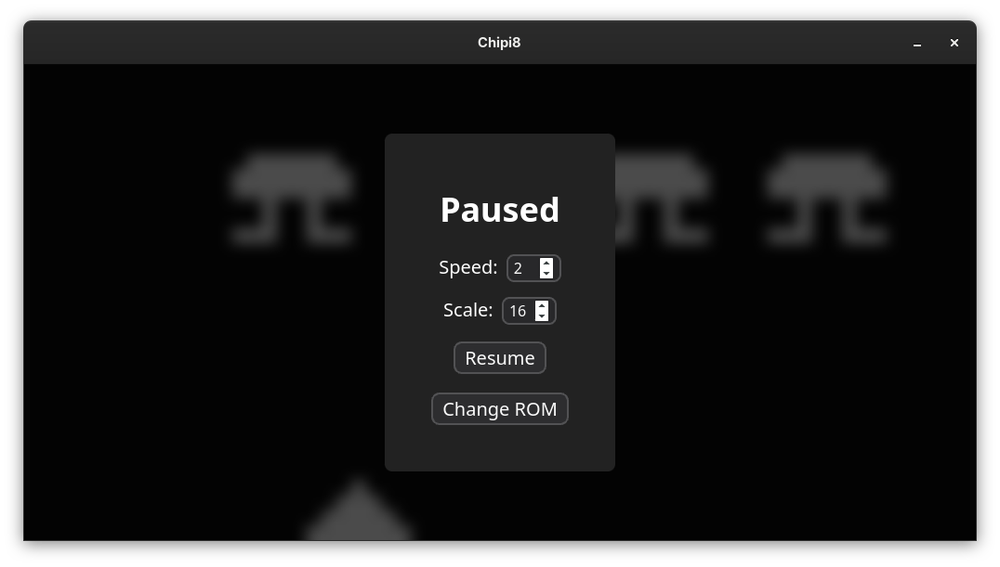

# Chipi8 CHIP-8 Emulator

A simple CHIP-8 emulator written in Rust and Svelte/TypeScript with Tauri.

## Keyboard mapping

| PC Keys    | CHIP-8 Keys |
| :---:      | :---:       |
| 1, 2, 3, 4 | 1, 2, 3, C  |
| Q, W, E, R | 4, 5, 6, D  |
| A, S, D, F | 7, 8, 9, E  |
| Z, X, C, V | A, 0, B, F  |

## Screenshots

## License

GNU General Public License version 3 or later.